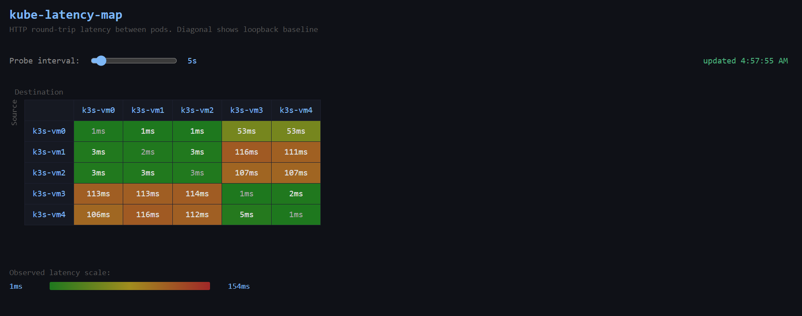

# kube-latency-map
 
A lightweight latency visualization tool for Kubernetes clusters. Deploys one pod per node via a DaemonSet, measures HTTP round-trip latency between all pods, and displays the results as a live updating matrix in a web UI.
 
Built as a validation tool for a multi-region k3s cluster, but should work any Kubernetes cluster.
 


**Note**: The nodes in this screenshot are each on an Azure VM in one of two regions:
| Node | Azure Region |
|--------|-------------|
| k3s-vm0 | `northcentralus` | 
| k3s-vm1 | `northcentralus` |
| k3s-vm2 | `northcentralus` |
| k3s-vm3 | `mexicocentral` |
| k3s-vm4 | `mexicocentral` |
 
---
 
## How It Works
 
Each pod runs the same Node.js application. On startup, each pod queries the Kubernetes API to discover its peers, then probes each of them over HTTP every 5 seconds (configurable). Any pod can serve the dashboard. Each pod fetches measurements from all peers, combines them with its own, and renders the full matrix.
 
Latency is measured as HTTP round-trip time rather than ICMP ping. ICMP requires `NET_RAW` capability which is restricted in most clusters by default. HTTP overhead is consistent across all measurements so relative differences between pods remain meaningful, but absolute values will be slightly higher than raw network latency. The diagonal of the matrix shows each pod's loopback RTT (a probe to itself) which can be used as a **rough** baseline for the HTTP overhead on that node.
 
---
 
## Prerequisites
 
- A running Kubernetes cluster
- `kubectl` configured to talk to it
- Nodes accessible to each other over the network

---
 
## Deployment
 
Clone the repo or download the `k8s/` folder:
 
```bash
git clone https://github.com/eb613819/kube-latency-map.git
cd kube-latency-map
```
 
Apply the manifests in order:
 
```bash
kubectl apply -f k8s/serviceaccount.yaml
kubectl apply -f k8s/rbac.yaml
kubectl apply -f k8s/daemonset.yaml
```
 
Watch the pods come up:
 
```bash
kubectl get pods -o wide --watch
```
 
Once all pods are `Running`, open the UI by hitting port `30080` on any node's public IP:
 
```
http://<any-node-ip>:30080
```
 
---
 
## Configuration
 
### Probe interval
 
The default probe interval is 5 seconds. This can be changed live from the UI using the slider.
 
To set a different default, add `PROBE_INTERVAL` to the env block in `k8s/daemonset.yaml`:
 
```yaml
env:
  - name: PROBE_INTERVAL
    value: "10000"  # milliseconds
```
 
---

## Teardown
 
```bash
kubectl delete -f k8s/daemonset.yaml
kubectl delete -f k8s/rbac.yaml
kubectl delete -f k8s/serviceaccount.yaml
```
 
---
 
## Permissions
 
The app uses a dedicated ServiceAccount with a single Role that allows it to list pods in its namespace. This is the minimum permission needed for peer discovery. No cluster-wide permissions are required.
 
---
 
## Project Structure
 
```
kube-latency-map/
├── server.js           # Express setup and startup
├── package.json
├── Dockerfile
├── src/
│   ├── discovery.js    # Kubernetes API peer discovery
│   ├── probes.js       # Probe loop latency measurement
│   └── routes.js       # HTTP endpoints
├── public/
│   ├── index.html      # Page structure
│   ├── style.css       # Styling
│   └── app.js          # Frontend logic
└── k8s/
    ├── serviceaccount.yaml
    ├── rbac.yaml
    └── daemonset.yaml
```
 
---
 
## Future Work
 
- Average vs latest measurement toggle in the UI
- Intra vs cross-region latency summary when topology labels are set
- Measurement age indicator/visual indication when a cell's data is stale
- Node location display in the matrix using `topology.kubernetes.io/region`
- TCP ping mode as an alternative to HTTP for lower-overhead measurement
